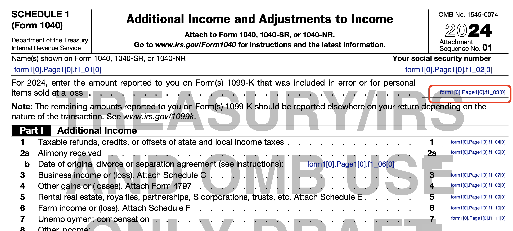

# Process for adding a PDF template 

In this context, "PDF template" refers to a PDF file that is used as a template for creating one or more pages of the PDF tax return download.

## Create the PDF template

There are two distinct kinds of PDF templates, called "forms" and "tables". Historically, the former referred to IRS-supplied PDFs that replicate official paper forms; now it can also refer to DF-created PDFs that report data the user entered from forms they received (e.g., 1099-R or W2). The latter refers to DF-created PDFs that define tables for listing additional information that would be separate user-provided sheets in a paper world.

When a DF-created PDF is used, the file should pass all of Acrobat Pro's Accessibility Checks, and should be analyzed and fixed with the Preflight tool. Use the Preflight fixes to embed all fonts into the PDF.

### Form type templates

- For forms, download the PDF from irs.gov. IRS tax year 2023 forms are in a zip file attached to a comment in issue #3464.
- Determine if all pages in the downloaded PDF are to be included. We generally exclude instructional and other pages that contain no form fields. If there are pages to exclude, the downloaded PDF must be manually pre-processed using Adobe Acrobat Pro.
    - Open the PDF in Acrobat Pro.
    - Use the Organize Pages tool to extract only the pages needed to a new PDF file.
    - Run the Accessibility Checker, and resolve any problems.
    - Use the Preflight fixes to embed all fonts into the PDF.

---
**Note.** Experience shows that this process for removing pages from IRS-provided forms hit an obstacle. IRS forms created using LiveCycle Designer sometimes contain XFA scripts. Adobe Acrobat Pro [cannot always edit](https://helpx.adobe.com/acrobat/kb/edit-xfa-form.html) such files in every way that we might wish.

To work around this, you can temporarily modify the PdfToYaml utility to remove the file's XFA scripts, then use Acrobat Pro to remove the unwanted pages as described above. For details, see the comment in the `writeOutput()` function in `PdfToYaml.java`. (Hint: search for "XFA scripts".)

This problematic process is an area of risk for the project until we 
- gain access to LiveCycle Designer software,
- decide to let "unwanted" PDF pages remain, or
- find some other solution.

If your work touches on these issues, seek assistance on Slack, and tag Steve M.

---

### Table type templates

- Table templates are created by DF designers using Adobe Acrobat.

## Configure the template

The application configurations (discussed below) allow for flexibility in location of template configurations. However, we have stuck to the following conventions, using tax year `2023` as a running example.

- Under folder `backend/src/main/resources/pdf/2023`, create a folder named for the template (e.g., `IRS8862`). 
- Under that, create folders `en` for the English configuration, and `es` for the Spanish version. (The remainder of these instructions will assume we are working with the English configuration, but you will need to repeat the entire process using the `es` folder for Spanish).
- In the `en` folder, place the new PDF template.
- In the same folder, create a new file `configuration.yml`.

You might be tempted to use a generic filename for the PDF template, eliminating the need to update the configured filename (if not its path) from year to year. But experience has shown it is useful to retain the filename used by IRS, which makes it easier to check what we are using.

### Populate the template's `configuration.yml`

- Add an include key and path. Every `configuration.yml` should contain exactly one `includeWhen:` key _or_ exactly one `includeForEach:` key. These top-level keys indicate when and how to include the template as part of the tax return PDF.
    - `includeWhen:` should be followed by a single path for a Boolean fact. The template will be included when the fact evaluates to `true`.
    - `includeForEach:` should be followed by a single path for a collection. The template will be included zero or more times: once for each collection item.
- Add a format key. Every config should contain a top-level `form:` key *or* a top-level `table:` key to indicate the type of template. These keys have values of complex object types that map PDF fields to data values. See the sections below for format-specific details. 
- `otherRequiredFacts`. This is an optional top-level key for an array (YAML bulleted list) of fact paths. These facts are not mapped to PDF fields; the PDF generation code uses them to compute "pseudo-facts", which are explained in the `PdfToYaml` utility's `README`. 

#### The `form:` key

This key and its contents configure the code in `class PdfService` to populate each PDF form field with the appropriate tax data. 

You will use the `pdfToYaml` utility to generate this key and its subkeys. See the `README` and source in folder `direct-file/utils/pdf-to-yaml/src/main/java/gov/irs/directfile/pdftoyaml` for details.

#### The `table:` key

The object value under this key specifies how to map the cells (fields) in DF-designed PDF tables to fact values.

All of the following keys are required.
- `rowCollectionPath:` defines a fact path for a collection.
- `itemsToSkip:` defines a non-negative integer value.
- `rowsPerPage:` defines a positive integer value.
- `columns:` defines an array of objects. Each object requires the keys
    - `factExpression:` defines a fact expression 
    - `fieldName:` identifies a field in a table cell

The `oncePerPage` key is optional. If present, it should define an array of objects. Each object requires the keys
- `factExpression:` defines a fact expression 
- `fieldName:` identifies a field outside of the table 

The values for `rowsPerPage` and `columns` must reflect the internal structure of the PDF template.

The `factExpression` values for `columns` will generally use paths that start with `../` because they will generally be attributes of the collection item that the row represents.

The `fieldName` key for `columns` is slightly misnamed; the code actually appends a row number to the `fieldName` value in order to identify a cell.

Code in `PdfService` will generate content by 
- ignoring the first `itemsToSkip` collection items in `rowCollectionPath`
- generating a table row for each remaining item, with columns and content defined by the `columns` array
- checking the row count against `rowsPerPage` and, when needed, inserting a new instance of the table template to generate another PDF page
- populating each page's fields outside the table according to the `oncePerPage` key, if defined. This can be used for headers, footers, etc. such as putting the filer's name and SSN on each page. 

## Update the application configurations

Now that the PDF template is fully configured, add it to the application's configurations. (As previously noted, much flexibility is possible here, but we stick to certain conventions, and use tax year `2023` as a runnning example here.)

- Edit `direct-file/backend/src/main/resources/application.yaml`. Under the nested headings `pdfs` and `configured-pdfs` add the following entries. These tell the application how to find the PDF template and configuration for a given form by tax year and language.

```
      - name: IRS8862
        year: 2023
        language-code: en
        location: pdf/2023/IRS8862/en/f8862_2023.pdf
        location-type: classpath
        configuration-location: pdf/2023/IRS8862/en/configuration.yml
        configuration-location-type: classpath
        cache-in-memory: true
```

- Edit `direct-file/backend/src/test/resources/application-default.yaml` and `direct-file/backend/src/test/resources/application-integration.yaml`. The entry for these two files are identical, but differ slightly from the version shown above: the location types are `directory` and the file paths are quoted. The locations refer to the same PDF and config, but since these application config files are in a different folder from the one above, the relative paths start from a different place.

```
      - name: IRS8862
        year: 2023
        language-code: en
        location: "src/main/resources/pdf/2023/IRS8862/en/f8862_2023.pdf"
        location-type: directory
        configuration-location: "src/main/resources/pdf/2023/IRS8862/en/configuration.yml"
        configuration-location-type: directory
        cache-in-memory: true
```


## Modify Java code 

In `PdfTemplate.java`, add a new object for your new PDF template to the static `templateList`. Be sure to keep the list in order by the Attachment Sequence Number found in the upper right of IRS forms.

- If the new PDF template is a form that uses pseudo-facts, you must create a new subclass of `PdfForm` and override method `computePseudoFacts` to define and populate the needed data. Instantiate your new sublass in the list.
- If the new PDF template is a form that does not use pseudo-facts, you can simply instantiate class `PdfForm`. 
- If the new PDF template is a table, you can simply instantiate class `PdfTable`. 

In all cases, the template name string passed to the constructor must match the application configuration's value of the `name` key for the template. (That's `IRS8862` in the examples shown above.)

# Guidelines for updating configurations when IRS updates PDF forms

All of the preceding content explains how to introduce a new PDF template into DirectFile's combined PDF download for a tax return. This section suggests ideas for handling IRS changes to PDFs, and shares lessons learned from experience. It assumes the reader is familar with the workings of DirectFile's PDF configuration, generation, and `PdfToYaml` utility. 

## Managing tax year transition: high-level configuration 

The DirectFile pilot launched for tax year 2023. Although the PDF configuration approach allows support of multiple years simultaneously, there was an early decision to support only tax year 2024 PDFs in our second filing season, not 2023 and 2024. As updated IRS PDFs for 2024 became available, we updated their configurations within the existing `2023` folder-- a quick/dirty approach that allowed us to move forward without coordination across teams. Because the folder name has no semantic meaning within the code, we could have indefinitely kept our 2024 configuration in the misleadingly named folder. But for clarity and sanity we eventually coordinated renaming of the folder to `2024`. (Note the trade-off between advance planning for multi-year support, vs. painful changing of a name that does not matter to the code.)

## Managing IRS changes to PDF form structure

For changes to the Schedule 1 English form from TY23 to TY24, IRS posted PDFs:

1. on 2024-06-21 as https://www.irs.gov/pub/irs-dft/f1040s1--dft.pdf, an early release draft
2. on 2024-12-06 as https://www.irs.gov/pub/irs-pdf/f1040s1.pdf, a "final" but not 508-compliant version
3. on 2025-01-22 as https://www.irs.gov/pub/irs-access/f1040s1_accessible.pdf, a 508-compliant version

Early release drafts include extra cover pages that explain details of posting drafts for feedback, and how they might change. These drafts cannot be used for production or actual filing purposes, both by IRS rules and due to prominent watermarks.

As the Schedule 1 dates indicate, 508-compliant PDFs are often not available from IRS until after the start of filing season. So DirectFile will probably start each filing season using some IRS PDFs that we describe as "final" (not draft, can be filed) but not accessible. Obviously we want to use the 508-compliant forms as soon as we can.

There is considerable detail complexity in tracking these PDFs across all our supported forms and two languages. There are also trade-offs to weigh involving effort, timing, and risk mitigation. Ideally, we would assess the scope and impact of changes for each PDF posting as early as possible. If the scope of changes is sufficiently large, and time allows, we can mitigate risk by implementing the changes early-- even with draft releases (the presence of extra cover pages cause no technical problems, but may require explanation/communication). However, this risk mitigation has a cost: it guarantees we must revisit the implementation later, if only to change to the non-watermarked, approved PDF. When changes are minor, there is advantage in delaying implementation so that it will not need to be revisited. See GitLab issue #10489 for details of tracking work for TY24. That ticket links to many others that contain an abbreviated form of the following guidance, written as instructions customized to the specific modifications.

## Assessing scope and impact of modifications to a PDF form

The `PdfToYaml` utility is the main tool for analyzing the changes when IRS posts a modified PDF.

First, use the utility to generate the `--pdf-fields` output for the new PDF. This will be an important reference tool-- the source of truth for understanding which internal field is associated with which line or input of the PDF rendered for human use. We'll look at an example from this output shortly. You may also find it useful to have this output for the baseline PDF that you are updating, but that is less likely. See the utility's README for details of generating the output.

Next, use the utility to generate the `--form-template` output for both the existing baseline PDF and the new PDF. This output is a YAML file that is the starting point for the `configuration.yml`'s `form:` key. The YAML keys correspond to the hierarchical structure of the fields in the PDF form. (Regardless of their appearance, a PDF can contain only one form.)

Generate a side-by-side diff (`-y`) of these outputs. Here is the start of diff output for two Schedule 1 PDF forms, showing the baseline on the left (2023 form) and modification on the right (early draft 2024). Each side shows the hierarchical structure of fields in the PDF form. Characters in between are diff tool output indicating changes. Most of the data is matching lines with no central symbol, indicating no change. (The full diff would show another page of form fields, but no difference between the two PDFs, so it's of no interest here.)

```
form:                                form:
  form1[0]:                               form1[0]: 
    Page1[0]:                                 Page1[0]: 
      # f1_01[0]:                               # f1_01[0]: 
      # f1_02[0]:                               # f1_02[0]: 
      # f1_03[0]:                               # f1_03[0]: 
      # f1_04[0]:                               # f1_04[0]: 
      # f1_05[0]:                               # f1_05[0]: 
      # f1_06[0]:                               # f1_06[0]: 
      # f1_07[0]:                               # f1_07[0]: 
      # f1_08[0]:                               # f1_08[0]: 
      # f1_09[0]:                               # f1_09[0]: 
      # f1_10[0]:                               # f1_10[0]: 
                                  >             # f1_11[0]: 
      Line8a_ReadOrder[0]:                     Line8a_ReadOrder[0]: 
        # f1_11[0]:               |              # f1_12[0]: 
      # f1_12[0]:                 <
      # f1_13[0]:                               # f1_13[0]: 
      # f1_14[0]:                               # f1_14[0]: 
      # f1_15[0]:                               # f1_15[0]: 
      # f1_16[0]:                               # f1_16[0]: 
      # f1_17[0]:                               # f1_17[0]: 
      # f1_18[0]:                               # f1_18[0]: 
      # f1_19[0]:                               # f1_19[0]: 
      # f1_20[0]:                               # f1_20[0]: 
      # f1_21[0]:                               # f1_21[0]: 
      # f1_22[0]:                               # f1_22[0]: 
      # f1_23[0]:                               # f1_23[0]: 
      # f1_24[0]:                               # f1_24[0]: 
      # f1_25[0]:                               # f1_25[0]: 
      # f1_26[0]:                               # f1_26[0]: 
      # f1_27[0]:                               # f1_27[0]: 
      # f1_28[0]:                               # f1_28[0]: 
      # f1_29[0]:                               # f1_29[0]: 
      # f1_30[0]:                               # f1_30[0]: 
      # f1_31[0]:                               # f1_31[0]: 
                                  >             # f1_32[0]: 
                                  >             # f1_33[0]: 
      Line8z_ReadOrder[0]:                      Line8z_ReadOrder[0]: 
        # f1_32[0]:               |               # f1_34[0]: 
        # f1_33[0]:               |               # f1_35[0]: 
      # f1_34[0]:                 <
      # f1_35[0]:                 <
      # f1_36[0]:                               # f1_36[0]: 
                                  >             # f1_37[0]: 
                                  >             # f1_38[0]: 
```

Combined with the experiential knowledge that comes from implementing the modifications, this is enough information to make an assessment of scope and impact. But that knowledge comes only from experience, so we'll move now to making the updates required to use the new PDF.

## How to implement modifications to form structure

The goal now is to transform the baseline mapping (the `form:` key in English Schedule 1's `configuration.yml`) from its existing structure (left side of the diff) to the new structure (right side of the diff) while preserving the semantic mapping of fact expressions. One way to do that is to arrange two text editors side by side. On the left, load the diff file shown above; on the right load the `configuration.yml` for editing. Here's the relevant part of that file as it was for the baseline 2023 Schedule 1 PDF from our example. This file was originally created with the `PdfToYaml`, so the structure below should match the structure on the left above (though we might have removed lines for fields we don't care about in the file below). Then the mappings were manually inserted to indicate what data, if any, goes in the field. Unmapped fields are generally commented out with `#`.

```yaml
form:
  form1[0]:
    Page1[0]:
      f1_01[0]: /primaryFiler/fullName space space /pdfSecondaryFiler/fullName
      f1_02[0]: /primaryFiler/tin
      # f1_03[0]:
      # f1_04[0]:
      # f1_05[0]:
      # f1_06[0]:
      # f1_07[0]:
      # f1_08[0]:
      # f1_09[0]:
      f1_10[0]: /unemploymentCompensation
      Line8a_ReadOrder[0]:
        # f1_11[0]:
      # f1_12[0]:
      # f1_13[0]:
      # f1_14[0]:
      # f1_15[0]:
      # f1_16[0]:
      f1_17[0]: /alaskaPfdIncome
      # f1_18[0]:
      # f1_19[0]:
      # f1_20[0]:
      # f1_21[0]:
      # f1_22[0]:
      # f1_23[0]:
      # f1_24[0]:
      # f1_25[0]:
      # f1_26[0]:
      # f1_27[0]:
      # f1_28[0]:
      # f1_29[0]:
      # f1_30[0]:
      # f1_31[0]:
      Line8z_ReadOrder[0]:
        # f1_32[0]:
        # f1_33[0]:
      # f1_34[0]:
      f1_35[0]: /alaskaPfdIncome
      f1_36[0]: /otherIncome
```

(You might want to try it now. Consider loading the diff further above in an editor pane on the left, and the file just above in a pane on the right. This might help in following along with the material below.)

There are three main patterns or scenarios of structural changes that we will explore. This will not cover everything you might encounter, but provide enough background to get started and to adapt to new situations. The first of these three sections is lengthy, but introduces enough material that the remaining two sections are quite brief. There's some new terminology, so words and phrases formatted _like this_ can be found in the Glossary at the end.

### Look for newly added fields

One common scenario in form modifications is the addition of new fields. From the diff, we see that the new form has two more fields under `Page1[0]`: their names contain the numbers 37 and 38. Experience teaches it's often best to address these added fields first due to their potential ripple effect. 

It would be a mistake to assume that the two new fields were added to the bottom of page 1. Keep in mind that the internal field names are generated with sequential numbers, so these names have no semantic connection with the external labels that are meaningful to people reading PDFs. The PDF form field representing "Line 1 of Schedule 1" can have its internal field name changed from one PDF version to another-- and it has, as we're about to see.  



The modified form shown here has introduced a new field (marked in red) just before the one that represents Line 1 of Schedule 1. The new field's _fully-qualified name_ is `form1[0].Page1[0].f1_03[0]`, which was the name given to the Line 1 field in the baseline PDF. The new form now identifies that Line 1 field with the next sequential identifier, `form1[0].Page1[0].f1_04[0]`. This ripples through all remaining _textbox fields_ under `Page1[0]`: they will have names with sequence numbers one greater than the baseline. (The sequential field numbering usually resets at the end of a page, so the renumbering does not ripple across page breaks.)

In the text editor on the right, we would update `configuration.yml` to reflect this structural change. The two text fields mapped to fact expressions for taxpayer name(s) and TIN/SSN are not affected, because they are before the newly inserted field. The next several mappings are commented out with `#`; they do not map to any fact data, so they need no changes. 

The first necessary change is to modify the line that reads 
```yaml
f1_10[0]: /unemploymentCompensation 
```

This is a fact expression mapping, for the output the Schedule 1 Unemployment Compensation line (Line 7 to people). We would expect the ripple effect to modify the key for that line to use a sequence number one greater. And we can confirm this by checking the `--pdf-fields` output shown above. The line should now be
```yaml
f1_11[0]: /unemploymentCompensation
```

Notice that this edit creates a gap in the key sequence in `configuration.yml`: there is now no line for mapping  the field with _partial name_ `f1_10[0]`. Because no fact data maps to that field (that is, DirectFile never populates Schedule 1 Line 6), this is not a problem *for system behavior*. However, experience teaches that it is best in the long run for `configuration.yml` files to accurately reflect the full structure of the PDF form, so we should insert a new line just above our edit like this:

```yaml
# f1_10[0]:
f1_11[0]: /unemploymentCompensation
```

You may find `configuration.yml` content created before experience taught us this lesson. Please update them to follow this convention when you can.

Another helpful convention is to add a comment to mapped keys:
```yaml
# f1_10[0]:
f1_11[0]: /unemploymentCompensation # Line 7
```

Unfortunately this is not yet widely applied. Note that it would probably be counterproductive to document unmapped (commented) keys in this way because there would eventually be maintenance effort for keys that we don't actually care about.

To completely address the ripple effect from the first new field, we would expect that all remaining text fields under `Page1[0]:` would increase their sequence number by one. In the right side editor we would update `configuration.yml` accordingly. 

Now that we've addressed the new field inserted before Line 1, we can turn to the second added field. Comparing the baseline and new PDFs, we see that Schedule 1 has a new Line 8v. (This is not shown in the partial screen image above.) The field for Line 8v was inserted so that it takes the partial name `f1_33[0]`, so every higher numbered text field under `Page1[0]:` will again increase by one in the sequence.

Here's the updated `configuration.yml`-- check your work in the right side editor if you're following along. (This example applies one other convention: commenting out _non-terminal keys_ where all their descendents are commented out.)

```yaml
form:
  form1[0]:
    Page1[0]:
      f1_01[0]: /primaryFiler/fullName space space /pdfSecondaryFiler/fullName
      f1_02[0]: /primaryFiler/tin
      # f1_03[0]:
      # f1_04[0]:
      # f1_05[0]:
      # f1_06[0]:
      # f1_07[0]:
      # f1_08[0]:
      # f1_09[0]:
      # f1_10[0]:
      f1_11[0]: /unemploymentCompensation # Line 7
      # Line8a_ReadOrder[0]:
        # f1_12[0]:
      # f1_13[0]:
      # f1_14[0]:
      # f1_15[0]:
      # f1_16[0]:
      # f1_17[0]:
      f1_18[0]: /alaskaPfdIncome # Line 8g
      # f1_19[0]:
      # f1_20[0]:
      # f1_21[0]:
      # f1_22[0]:
      # f1_23[0]:
      # f1_24[0]:
      # f1_25[0]:
      # f1_26[0]:
      # f1_27[0]:
      # f1_28[0]:
      # f1_29[0]:
      # f1_30[0]:
      # f1_31[0]:
      # f1_32[0]:
      # f1_33[0]:
      # Line8z_ReadOrder[0]:
        # f1_34[0]:
        # f1_35[0]:
      # f1_36[0]:
      f1_37[0]: /alaskaPfdIncome # Line 9 (sum of 8a to 8z)
      f1_38[0]: /otherIncome # Line 10
```

### Look for deleted fields

If a modified PDF removes fields that were found in the baseline, there would likely be a ripple effect similar to the addition of fields, but in reverse. That is, the sequence number in the names of all similar fields under the nearest non-terminal key would likely decrease by one. Edits to the YAML configuration would be correspondingly similar to the example of added fields above.

### Look for changes in reading order

It's usually best to deal first with all ripple effects due to added and deleted fields. Then you can turn to this, the third and final pattern of content changes that we have observed as a repeating scenario.

The sequence number typically embedded in field names generally increases with the vertical page position. That is, `f1_01[0]` is likely to be the first textbox field on a PDF page, positioned higher up the page than `f1_02[0]`. These sequences are likely to be related (but not identical) to the reading order. Accessible PDFs define a reading order for all relevant content elements, which informs screen reader software of the expected order of presentation. 

One common departure from ordering by vertical position occurs when a PDF contains several fields arranged horizontally across the page, at nearly the same vertical position. This occurs most commonly, but not always, with groups of _checkbox fields_. Sometimes we see PDF form structure changes that are refining the read order to improve accessibility.

Here's an example. This partial diff of `--form-template` outputs for baseline and modified PDFs shows that a new non-terminal key has been added, apparently to adjust the reading order. Assuming this is the only change affecting these fields, the update for PDF YAML configuration would be straightforward: copy and paste the new non-terminal key into the file below the line for `f1_08[0]`, and indent the line for `f1_09[0]` under the new key. Make no other changes to the line for `f1_09[0]`; that is, if it's commented out then leave it that way but if it has a mapping leave that in place. 
```
      # f1_08[0]:                   # f1_08[0]: 
      # f1_09[0]:            |      Line6a_ReadOrder[0]: 
                             >        # f1_09[0]: 
      # f1_10[0]:                  # f1_10[0]: 
``` 

### The importance of indentation

The YAML files that configure PDF form generation use two spaces for indenting. Indentation affects the meaning of YAML files, so it is vital that it be correct.

It's also important that we are able to know the original indenting of lines that we comment out. In other words, the characters added when commenting out a line should be added in a consistent way, so that they can be removed in a consistent way to uncomment the line.

Unfortunately, we learned from experience that the first convention adopted, while reasonable for humans, was more difficult for the utility to generate in its outputs. That convention was to overwrite the space character with the comment character (`#`) so that the indenting clearly indicated the correct structure. An example is shown below because you may still encounter it.

This is no longer the convention that we want to follow.
```yaml
  Page:
    Section 1:
      Subsection 1.1:
#     Subsection 1.2:
    Section 2:
      Subsection 2.1:
      Subsection 2.2:
```

Instead, follow the convention shown below, which is used for all examples in this document (except the one just above).
```yaml
  Page:
    Section 1:
      Subsection 1.1:
      # Subsection 1.2:
    Section 2:
      Subsection 2.1:
      Subsection 2.2:
```
Here, the comment character and a single space are inserted at the indent point of the key. To uncomment, delete the comment character and one space.

### Final steps

With the `configuration.yml` file updated, you're almost ready. 

Don't forget to put the new PDF template in place alongside the updated configuration, and to change the application configuration files as described in the earlier portions of this document. You might be tempted to use a generic filename for the updated PDF template, eliminating the need to update the configured filename (if not its path) from year to year. But experience has shown it is useful to retain the filename used by IRS, which makes it easier to check what we are using.

Run the PDF scenario tests, and there should be changes to the snapshots (i.e., test "failures"). Verify that these changes align with your expectations from the configuration changes. Verify that all scenarios that should be affected by your changes are affected, and vice-versa. When everything is good, you can commit the new snapshots. You should also visually examine the new PDFs with Adobe Reader or similar. The scenario snapshots are only looking at internal structure and data values, so it's entirely possible that the tests would pass even though something was not rendering correctly.

Now you're done. At least with this form. For this language. For this modification.

# Glossary

Important note: this glossary describes observed patterns in the naming of elements found within IRS PDF forms. These patterns are presumably due to the behavior of tools used to author the forms, and could change. Nothing in DirectFile coded logic or configuration relies on these patterns, nor should it. The patterns are described only for assisting human understanding.

- checkbox field. One of two form field types in IRS PDFs, and the least common. These are typically mapped to boolean or enumerated fact types. Compare "text field". We have observed the following patterns for naming checkbox fields.
  - partial names are prefixed with `c`, often followed by a digit corresponding to page number
  - after the prefix, partial names often contain an underscore followed by a two-digit sequence number. The sequence number applies to checkbox fields only, and resets to 1 for eah page.
- fully-qualified name. The complete name of a form field, with all namespaces included using dot separators. Example: `form1[0].Page2[0].f2_01[0]`, which is likely to be the first text field on page 2 of some PDF. The fully-qualified name corresponds to a hierarchy of nested keys in the PDF `form:` YAML configuration.
- non-terminal key. A YAML key with other keys nested under it. In PDF YAML configuration, these often group fields in ways corresponding to pages or sections of the form. Another common use is to group fields for accessibility, defining reading order used by screen readers.
- partial name. The last portion of a form field's fully-qualified name. Example: `f2_01[0]`, which is likely to be the first text field on page 2 of some PDF. The partial name corresponds to a terminal key in the PDF `form:` YAML configuration.
- terminal key. A YAML key with no keys nested under it. In PDF YAML configuration, any value mapped to a terminal key is a fact expression that defines the information to be populated in the field corresponding to the key.
- text field. One of two form field types in IRS PDFs, and the most common. These may be mapped to almost any type of fact data, though boolean or enumerated are unlikely. Compare "checkbox field". We have observed the following patterns for naming text fields.
  - partial names are prefixed with `f`, often followed by a digit corresponding to page number
  - after the prefix, partial names often contain an underscore followed by a two-digit sequence number. The sequence number applies to text fields only, and resets to 1 for eah page.
