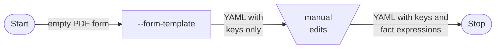
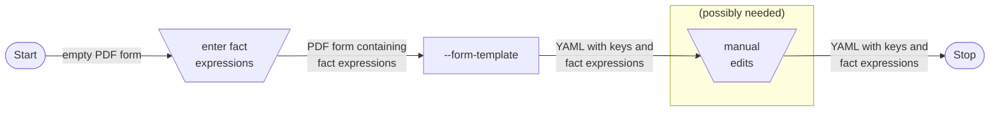
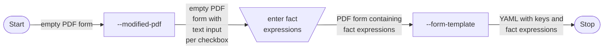

# `pdf-to-yaml` utility

This utility transforms a set of one or more PDF files into one of four output formats. For each PDF, there will be a corresponding output file with format determined by command line option.

Two of the options output a YAML file for each PDF.
- the YAML "value map" format captures the data of a tax return PDF as expected values for scenario tests
- the YAML "form template" format is used to configure `PdfService` with a mapping of PDF fields to fact expressions

Although the utility name was not changed to reflect their addition, the other two options write a new PDF for each input PDF.
- the PDF fields format populates the PDF form fields to displaying their own internal name 
- the modified PDF format supports easier generation of fact expressions in `configuration.yml` files

## Value maps

The `--value-map` output format coverts a PDF form populated with data into a YAML format used by scenario tests. Adding the YAML file to the test scenarios folder defines the expected result for a new scenario. (A corresponding JSON file of fact data is needed to drive the scenario test, but this utility isn't relevant to that.)

Since the introduction of PDF scenario tests that write snapshots in this format, there is little need to produce it with this tool.

## PDF fields

Internally, PDF form fields are hierarchically named, with dot separators. For example, a field could be named something like `form1[0].Page1[0].f1_02[0]`.

Often we need to know the internal field name for a field that we think of by IRS form number and line number, or description like "the 1040 field for primary filer's TIN". Apparently there is no feasible way to automatically associate a PDF form field with the PDF body text that "labels" it. The `--pdf-fields` output format helps to address this.

This output format produces a PDF where each field is populated with its own fully-qualified name. For checkboxes, which cannot contain text, an ad hoc text control is created to hold the name. For those ad hoc fields and some others, it will be difficult or impossible to read the rendered name, but there is a workaround. While viewing the rendered PDF, click in the problematic field. Use select all and copy, then paste into a text editor or other handy place to see the name.

Generally, the sequential numbering of fields will correspond to their position on the page, but there is no guarantee of this.

## Using form templates to configure `PdfService`, with or without a modified PDF 

The form template output format is a YAML file with a hierarchy of keys that represent the input PDF's hierarchy of form input fields. Each key is one line in the output.
- Lines generated for "nonterminal" PDF fields end with a colon; these will have other fields indented under them, reflecting the hierarchy of the form's structure. Leave these in place to accurately reflect the form structure.
- Lines for terminal PDF fields (the "real" user visible form inputs) will be generated in different ways, depending on the content and format of the PDF input. Details will be covered in the workflow descriptions below.

In all cases, the goal is to map the YAML keys for the fields you care about to the tax data that should be displayed there in the tax return PDF. Each field that you need to populate must have its YAML key associated with a "fact expression". A fact expression is a sequence of tokens. Tokens can be:
  - the literal `space`, representing a single space character
  - the literal `newLine`, representing a new line character sequence
  - a fact path from the fact dictionary
  - a "pseudo-path" named with a tilde
    > `PdfService` relies on class `FactEvaluationResult` to manage a map of fact values keyed by fact path. A pseudo-fact is an entry in this map that does not exist in the fact dictionary; it is populated by `PdfService`. The path for a pseudo-fact is a "pseudo-path"; these can be identified by the presence of a tilde in the path; genuine fact paths should never use a tilde. *See the main `PdfService` `README` for implications of using pseudo-facts.*
  - a collection index path
    > Fact expressions support a syntax for zero-based indexing of collection items. For example, `/claimedDependentsCollection/[0]/tin` is not a valid fact dictionary path, but can be used in fact expressions to access the TIN of the first claimed dependent. Out-of-bounds indexes are handled silently but safely; the `FactEvaluationResult` methods `getBoolean`, `getString`, and `getOptional` will respectively return `false`, the empty string, and `Optional.empty()`.

The code in `class PdfService` will populate each field with the evaluated result of the fact expression. The following simple examples assume there are only two facts in the dictionary: `/firstName` with value `Ada` and `/lastName` with value `Lovelace`.

- `f1: /firstName` will populate the PDF field named `f1` with the value `Ada`.
- `f2: /firstName /lastName` will populate PDF field `f2` with the value `AdaLovelace`.
- `f3: /firstName space /lastName` will populate PDF field `f3` with the value `Ada Lovelace`.
- `f4: /lastName newLine /firstName` will populate `f4` with
    ```
    Lovelace
    Ada
    ```
- `f5: /noFact` will leave `f5` blank because the named fact does not exist.

There are various approaches for where and how to enter these fact expressions. Here are the alternative workflows.

### Entirely manual option

- Use this utility to transform an unpopulated PDF form (e.g., PDF direct from IRS) into a skeleton `--form-template` file containing keys without values.
- Keys for terminal fields will be commented out.
- Using a text editor, remove the comment from each terminal field that should be populated. To the right of the colon, write a fact expression.



### Partly automated option

- Use Adobe Acrobat[^*] to type fact expressions directly into the text inputs of the PDF form.
- Then use this utility to transform that PDF into a `--form-template` file.
- Keys for nonterminal fields where you entered a fact expression will be uncommented, with the fact expression in place. Other nonterminal keys will be commented out and have a blank value.
- The resulting YAML file can be modified manually, with any text editor.
- You may hit certain obstacles trying to enter fact expressions into the PDF form (see next workflow for details). If so, it will be necessary to either map them manually with a text editor (see above), or use the next workflow.



### More automated option

Depending on the PDF form, you may encounter these obstacles to entering fact expressions into the form.
- Some text inputs enforce a character limit that prevents entering the complete fact expression needed.
- There is no way to type a fact expression into a checkbox input.

This utility can address these obstacles by producing a modified PDF that removes character limits and associates each checkbox with a new ad hoc text input. 

- Use this utility to transform an unpopulated PDF form (e.g., PDF direct from IRS) into a new `--modified-pdf` format. 
- Use Adobe Acrobat[^*] to type fact expressions into the modified PDF's text inputs, including the ad hoc text inputs associated with each checkbox.
- Then use this utility to transform that PDF into a `--form-template`.
- Keys for nonterminal fields where you entered a fact expression will be uncommented, with the fact expression in place. Other nonterminal keys will be commented out and have a blank value.
- The YAML will exclude the ad hoc text inputs, but map the fact expression you typed to the associated checkbox in the original form.
- It's possible but not necessary to manually edit the file.


---
It's always possible to manually edit the YAML with a text editor. You may benefit from a tool that shows you the internal field names for the friendly field names that the reader sees in the PDF template. For example, `topmostSubform[0].Page1[0].f1_04[0]` is the internal name for the filer's "First Name" field in the Form 1040 PDF.

If your PDF software does not provide this, one online option is pdfFiller.com.
- Upload the PDF, and click on the green tab on the right with the label "EDIT FILLABLE FIELDS".
- Click on a field to see it's name on the right.
- Click "Order" on the menu on the right to see the whole list of field names.

## To compile

In this directory, execute `./mvnw compile`

## To execute

In this directory, executing `./mvnw exec:java -Dexec.mainClass=gov.irs.directfile.pdftoyaml.PdfToYaml -Dexec.args=""` will display:

```
Usage:
Argument 1: path to PDF(s). `./file` processes PDF `file`; `./dir/` processes *.pdf in `dir`
Argument 2: output directory.
Argument 3: output format. `--value-map`, `--form-template`, `--modified-pdf`, or `--pdf-fields`
```

Modify the previous command, placing your desired arguments inside the empty pair of quotation marks.

### Notes
- The first argument can be a path to one PDF file or a directory path that ends with `/`. In the latter case the utility will process `*.pdf` in the directory. 
- Output files are written to the directory given as the second argument with the filename(s) based on the input PDF(s). 
  - For `--modified-pdf` and `--pdf-fields`, the output directory must be different from the location of the input PDF(s). Overwriting a PDF in place can corrupt the file.
  - For other output formats, the file(s) will have `.yml` extension in place of the `.pdf` on the input file(s).

---
[^*]: Unfortunately, many PDF tools will modify the form structure of the PDF when you save your inputs, which will break the workflows described here. Use Adobe Acrobat or take care to check all outputs until your alternative PDF tool is proven safe.