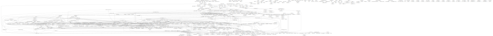
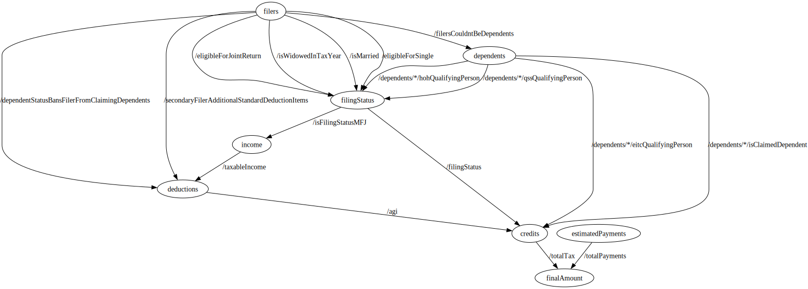

# ADR: Fact Dictionary Modules (and how to test them)
DATE: 11/27/2023

## TL;DR

Creating modules for facts should let us move from an untestable amount of complexity and interactions between facts to well defined boundaries that developers can reason about and test.

## Background

### The hodgepodge of facts and completeness

At the moment we have 451 derived facts and 261 writable facts in the fact dictionary. Any derived fact can depend on any other fact (written or derived from any section of the app), and any fact can be in any state of completeness, which can bubble through derived facts, leading to unexpected outcomes. In particular, bugs or errors written in the "You and Your Family" section might not manifest themselves until the final amount screen. These bugs are common and creating a game of whack-a-mole, and we need to replace whack-a-mole with a stronger system that prevents moles in the first place.

Additionally, the fact dictionary is hard to reason about in its current form due to these sometimes-odd relationships. A developer modifying social security may need to reason about a fact from the filer section that may or may not be intended for usage outside of that section.  

In a world where any node can depend on any other node, we have to test everything, everywhere, all of the time, instead of being able to separate our tests into logical chunks and the boundaries between those chunks. 

The current state of our fact dictionary looks like 

### Example bugs caused by untested interactions between sections

These are a few examples of where bugs in some sections have manifested in strange ways in the app, but 

1. When Married Filing Separately, (MFS), we never collected `secondaryFiler/canBeClaimed` (because it should not matter), but this led to a person getting stuck at the deductions section since `/agi` would be incomplete. We should have made sure that `/filersCouldntBeDependents` was always complete by the end of the spouse section .
2. When filing as either married status, and the filers did not live apart for at least six months, our social security section would break because we did not know if the filers lived apart all year. . 
3. Any incompleteness bug in the app will leave `/dueRefund` incomplete (based on the tax calculation being incomplete), and the user will break on the 'tax-amount-number' screen.

### Testing for completeness

We have [completeness tests](../direct-file/df-client/df-client-app/src/test/functionalFlowTests/checkFlowSetsFacts.ts) that can test that a section of the flow will leave certain facts as complete. However, it's unclear which facts we should test for completeness at which points because there are no well defined boundaries between sections. For instance, in example (1) above a test that `/filersCouldntBeDependents` was complete by the end of the spouse section would have prevented the bug, but nobody knew to write that test.

Beyond that, even if we get this right at some point, there's no guarantee it will remain correct, or that developers writing downstream tests will always respect  a `/maybeCompleteFact` that gets a default value in derived fact `/alwaysCompleteFact`, there's no guarantee that a downstream fact will correctly use `/alwaysCompleteFact` instead of accidentally using the maybe complete version. 

## Proposed solution -- setting healthy boundaries via modules

### Goals

- When working on a section of the app (e.g. a credit like the EITC, or an income type like an SSA-1099), a developer should only need to reason about the facts in that section, and other well-tested, known-to-be-complete facts from other sections. 
- Facts that are relied on across sections should be a defined set with high test coverage, and each fact should have a point in the flow where they are known to be complete. 
- We should be able to think separately about testing facts within a section, and facts that cross boundaries between sections similar to how we can think about testing implementations and API boundaries.
- Find a way or ways to reduce the risk of unintended consequences when adding, changing, or deleting facts by limiting the possible dependencies of a fact

### Proposal

1. (must) We introduce two new concepts to our facts:
    1. A module defines a logical section of the fact dictionary, such as the EITC, the educator deduction, or social security income. It *may* align with a section of the flow, but that is not required, and the fact dictionary continues to not know about the existence of the flow. All facts should exist in a module. During a transitionary period, `ty2022` will be a module. 
    2. Facts default to being private to their own module. They can be exported from their module for two purposes -- they can be exported for `downstreamFacts` and for `mef`. Our build will fail if a fact in one module depends on a private fact from a different module. 
2. We break `ty2023.xml` into multiple files -- one file per module. The module name will be equivalent to the filename -- e.g. `eitc.xml` will produce the module `eitc`. This helps developers understand the scope of their current changes, and is consistent with modularity patterns in programming languages. It additionally allows test files to align their naming with the section of the fact dictionary that they test, and should be helpful towards us tracking per-module test coverage.
3. We test module dependencies at build time, but we will strip away the module information for runtime -- fact dictionary paths are complicated, and December 2023 is not a good time to mess with them. The runtimes on the frontend and backend will continue to run with a full list of facts, like they currently do.
3. (should) We continue writing our fact dictionary tests in vitest tests since we have many existing tests in that framework that we can re-use, and we can easily run these tests. In the future, we may change these to a more language-angostic format such as a spreadsheet. 

#### Example
```xml
spouse.xml
    <Fact path="/writableLivedApartAllYear">
      <Name>Writable lived apart from spouse the whole year</Name>
      <Description>
        Whether the taxpayer lived apart from their spouse for the whole year.
        Use `/livedApartAllYear` for downstream calculations
      </Description>

      <Writable>
        <Boolean />
      </Writable>
    </Fact>


    <Fact path="/livedApartAllYear">
      <Name>Lived apart from spouse the whole year</Name>
      <Description>
        Whether the taxpayer lived apart from their spouse for the whole year.
        Takes into account that we only ask this question if the TP and SP
        lived apart the last six months.
      </Description>
      <Export downstreamFacts="true" />

      <Derived>
        <All>
          <Dependency path="/writableLivedApartAllYear" />
          <Dependency path="/livedApartLastSixMonths" />
        </All>
      </Derived>
    </Fact>

...
eitc.xml
    <Fact path="/eligibleForEitc">
    ...
      <Dependency module="spouse" path="/livedApartAllYear" /> 
    ...
    </Fact>
```


And with that, our fact dictionary should go from the complicated "any node to any node" setup, to instead look more like this graph, where the exported facts are the edges between namespaces, and we can write tests to check internal to a namespace, or using the boundary between namespaces.

Instead of having to test something as complicated as the above fact graph, we'll instead have something that looks closer to 

Whereas testing the above any node to any node setup seems impossible, this looks like discrete chunks we can think about. 

### Build Time Checks

We should build the following tests into our pre-merge CI pipeline:

- (must) A derived fact in a namespace only depends on facts in its own namespace or facts exported from other namespaces. For now I propose this being static analysis, but in the future, the fact graph itself could know about namespaces and do runtime checking. 
- (should) A fact that is exported from a namespace is tested to be complete by some point in the flow, before it starts getting used by other namespace (e.g. after you complete the spouse section `/filersCouldntBeDependents` should always be complete). We can use our existing completeness tests for this, but modify them to test "All exported facts from a namespace" rather than a manually created and maybe-out-of-sync list defined in a typescript file. 
- (should) Exported facts should be tested for correctness within their own section, and then can be relied on to be correct outside of their section (e.g. we've tested the various combos of `/filersCouldntBeDependents` for each filing status and writable fact scenario. There's no need for the deductions section to check every combo of the tree of facts upstream of `/filersCouldntBeDependents`).
- (must) The MeF integration should only use variables that are exported from a module for MeF. We may not immediately use this functionality, as it requires additional work (MeF sometimes intentionally depends on incomplete varaibles)


### Future work
After this we can investigate any of the following:
1. Using the new, better-defined inputs into a section to inform test coverage of that section (e.g. better understanding that TIN/SSN validity could affect W2 completeness could have prevented as bug TKTK
2. Moving fact dictionary tests from typescript to a language agnostic format
3. Making the fact graph itself aware of namespaces and adding runtime checks. 
4. Measuring test coverage of each derived fact (I don't know how to check that we've actually hit every statement in a switch, etc.)
6. Perf improvements to the NP-hard flow tests

But most of the above will be a lot easier if we understand the boundaries we can test instead of trying to test everything, everywhere, all of the time. 


## Changelog
1. (12/4/23) Modified the term "namespace" to "module"
2. (12/4/23) Specified file name as module names
3. (12/4/23) Defaulted facts private to their module
4. (12/4/23) Specified how modules will be imported by Dependency blocks