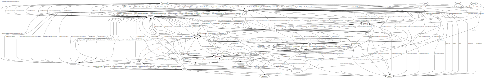

# Tax Logic Testing Strategy 
12/15/23

## Problem Statement
The goal of Tax Logic Testing is to test:
1. Do we show users the correct screens and collect the correct information from each user based on their previous answers? This document refers to this problem as _completeness_ for whether the user has completed the correct screens and input a complete set of data. (Flow + fact dictionary interactions)
1. Do we correctly compute filing status, dependency, deduction, and credit eligibility, as well as the final tax amount calculations? This document refers to this problem as _correctness_ for whether our derived facts have the appropriate calculations.  (Fact dictionary interactions)
1. Are we resilient to review + edit conditions (telling a user to resume where they need to resume and using only valid data)? (Flow + fact dictionary interactions)

We want to make sure that we are testing each of these criteria, automatically, on every pull request. We have already built most test infrastructure that we need for this. For our next steps, as we move closer to the pilot, we need to define and increase our test coverage for each of these problems. 

## Where this proposal falls into the overall test framework

These tests, and this document, cover a lot of tax logic, but these are three areas outside of our scope:

### Scenario tests
The testing team will perform "scenario testing," which is an integration test that applies scenarios and checks that the expected tax burden is correct. This test type is a black box test, where it only registers a `PASS` or `FAIL` (with expected and observed values). This test's goal is to run through as many scenarios as we can very quickly to identify regressions. 

### Manual testing with subject matter experts
We're relying on the testing team to go through a greater level of scenario testing + manual testing and file bugs on us when they find issues. We should hopefully be able to identify where we were missing a test, write a failing test case, and then fix the issue. SMEs and tax policy experts doing manual testing is how we might plan to find issues in _our understanding_ of the tax code. 

### Testing after a user submits their data
This testing goes from the user through to the fact graph. We are testing that we generate the correct derived facts. This testing does not include MeF integration -- the backend team is responsible for translating our fact graph representation into MeF XML (though we will gladly help with facts!)

## Methods
Based on the recent modularization of the fact dictionary, we've defined that ~140 of the ~800 facts are used in multiple sections of the app -- these facts, which we can call **culminating facts** are the ones that determine a tax test, eligibility, or computation, and they should be selected for additional test coverage. We base our test strategies around proving the completeness and the correctness of each culminating fact. 

The vast majority of our bugs during development have happened from these culminating facts either having been incomplete (e.g. you went through the dependents section, but we still didn't know if that dependent qualified for Child Tax Credit), or incorrect (e.g. The taxpayer was born January 1, and we calculated their Standard Deduction wrong). 

This graph shows the current state of 143 culminating facts connecting our 21 independent modules:

This is the graph that we must test. We have four generalized types of tests, each of which have their own purpose in our testing strategy. All tests run on pre-merge, prior to every commit and deploy of our codebase. 

### 1. Testing for Completeness
Historically, this has caused our largest area of bugs, but we have recently made strides by being able to test that a section will always complete certain facts. For this, we use our `flowSetsFacts` tests. This tests a combination of both our flow and fact dictionary. Existing tests live in ../direct-file/df-client/df-client-app/src/test/completenessTests

These tests run via a simulator that follows all potential paths in the flow for each potentially consequential answer to a question. Given this, the tests are computationally expensive to run, but have a low margin for manual error compared to our other forms of testing. We additionally have more work to do until we can run this on the largest sections of the app (spouse and dependents)

#### Test Examples
* At the end of the spouse section, do we know whether the taxpayer (and a potential spouse) need to be treated as dependent taxpayers? 
* At the end of a dependents collection item, do we know is a person qualifies as a dependent, or a qualifying person for each filing status + credit?
* At the end of the W2 section, do we know the employer wage income of a person, as well as whether they have combat pay?

#### Coverage
We need to begin measuring our coverage of each of the culminating facts. Every culminating fact should be known to be complete by the end of a section in the app. 

### 2. Testing for Correctness
Each of our culminating facts should represent a concept in the tax code (e.g. a rule, or eligibility, or a computation), or an important fact on the way there. We write vitest facts that generate a fact graph, and test that our fact dictionary rules represent our understandings. Existing tests live in ../df-client/df-client-app/src/test/factDictionaryTests. This tests just the fact dictionary. 

This requires a potentially high volume of tests to be written for each culminating fact, and also may require taking other culiminated facts as input. When a tax bug is reported, we should generally be able to write a fact dictionary test that would prevent the bug from occurring again. 

#### Examples
* After a certain income amount, the student loan adjustment will begin to phase out. 
* A taxpayer will receive an additional amount of standard deduction if they are over 65. 
* A person is ineligible for Qualifying Surviving Spouse status is they were ineligible to file jointly the year of their spouse's death. 
* A child without an ssn can qualify a taxpayer for EITC, but is not used in the computation.

#### Coverage
We need to measure how many of our culminating facts have unit test coverage.

### 3. Functional Flow Navigation
After each screen, we must use the current fact graph state to choose the screen the user will see next.  The screens the user sees affects the data that is collected. To test that the user sees the right screen based on their answers, we have written functional flow tests. For each screen, we test a starting state, being on the screen, setting a fact, and testing what screen the app will move to next. Existing tests live in ../direct-file/df-client/df-client-app/src/test/functionalFlowTests. 

Creating these tests can be prone to manual error since it requires a developer to reason about the potential next screens after any screen. Combined with our completeness tests above, this checks that the user has input the correct data. This test a combination of the fact dictionary and flow. 

#### Examples
* A taxpayer who says they were a US Citizen all year will move to being asked about their state residency. If they were not a taxpayer all year, they will be asked if they were a taxpayer at the end of the year. 
* A taxpayer who notes that they lived in a single, in-scope state will go on to next enter their TIN. A taxpayer who says they lived in multiple states will move to a knockout screen.

#### Coverage
We need to track what percentage of screens we have as a starting point in a functional flow test, and what percentage of screens we navigate to in a functional flow test. 

### 4. Static Analysis
We use static analysis (mostly TypeScript type safety) to ensure that we are reading facts that exist and writing to facts that are well defined. Similarly, we use static analysis to ensure that derived facts are only using culminating facts from other sections, and never internal facts that haven't been meant for consumption. 

We can build additional static analysis that may help us with our robustness to edits. 

#### Test Examples (existing)
* The client reads `/isEligibleForEitc` -- that is a fact defined in the fact dictionary. 
* We write a boolean value to `/livedWithTaxPayerAllYear` -- that is a boolean value in the fact dictionary
* EITC relies on a dependent having qualified as an EITC qualifying child in the dependents section. We check that "/isEitcQualifyingChild" is marked as exported from the dependents module. 
* A fact is used by MeF. We check that that fact exists in the fact dictionary. 

#### Coverage
Static analysis operates on the full codebase and does not have a coverage metric. 